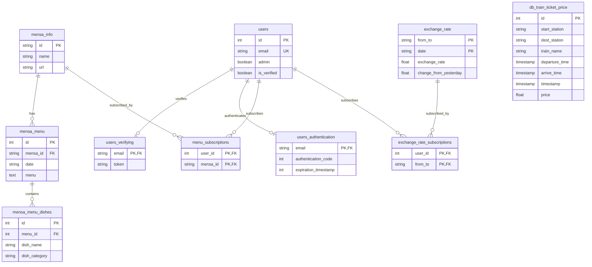

```mermaid
erDiagram
    mensa_info {
        string id PK
        string name
        string url
    }

    mensa_menu {
        int id PK
        string mensa_id FK
        string date
        text menu
    }

    mensa_menu_dishes {
        int id PK
        int menu_id FK
        string dish_name
        string dish_category
    }

    users {
        int id PK
        string email UK
        boolean admin
        boolean is_verified
    }

    users_verifying {
        string email PK, FK
        string token
    }

    users_authentication {
        string email PK, FK
        int authentication_code
        int expiration_timestamp
    }

    exchange_rate {
        string from_to PK
        string date PK
        float exchange_rate
        float change_from_yesterday
    }

    menu_subscriptions {
        int user_id PK, FK
        string mensa_id PK, FK
    }

    exchange_rate_subscriptions {
        int user_id PK, FK
        string from_to PK, FK
    }

    db_train_ticket_price {
        int id PK
        string start_station
        string dest_station
        string train_name
        timestamp departure_time
        timestamp arrive_time
        timestamp timestamp
        float price
    }

    mensa_info ||--o{ mensa_menu : has
    mensa_menu ||--o{ mensa_menu_dishes : contains
    users ||--o| users_verifying : verifies
    users ||--o| users_authentication : authenticates
    users ||--o{ menu_subscriptions : subscribes
    users ||--o{ exchange_rate_subscriptions : subscribes
    mensa_info ||--o{ menu_subscriptions : subscribed_by
    exchange_rate ||--o{ exchange_rate_subscriptions : subscribed_by
```
